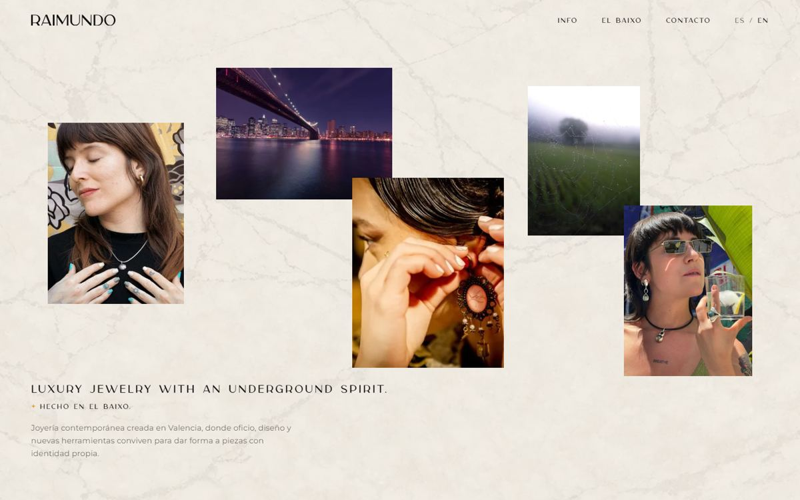
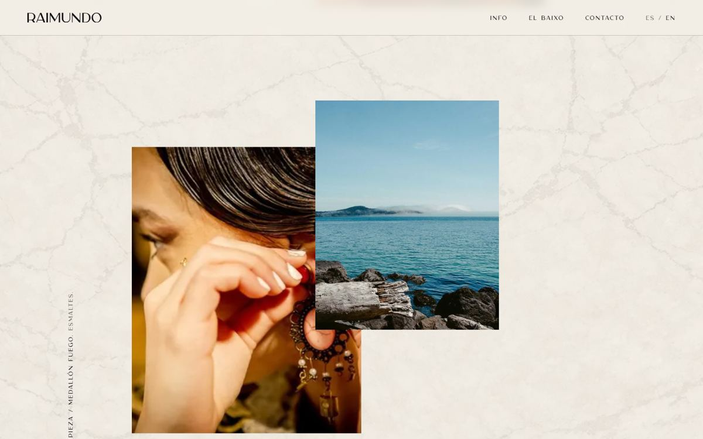
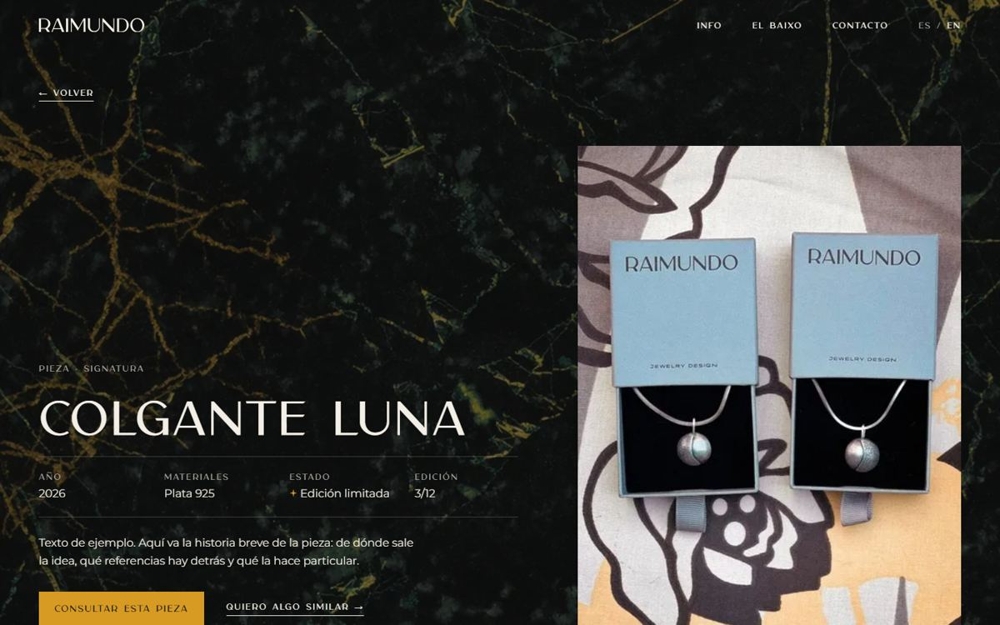
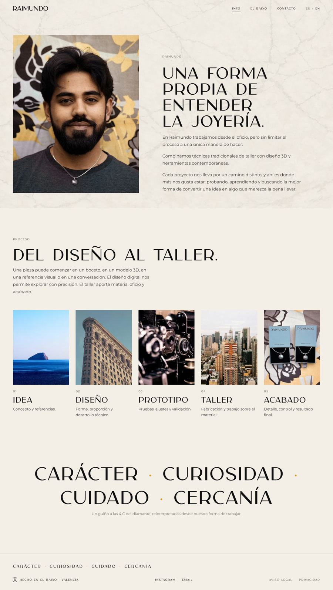
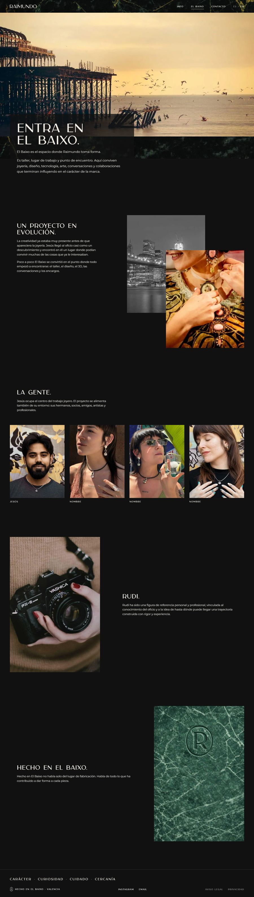
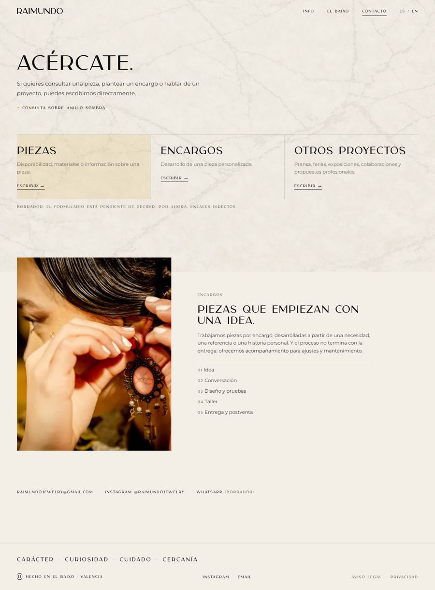
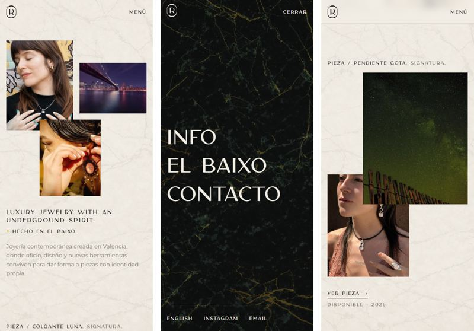
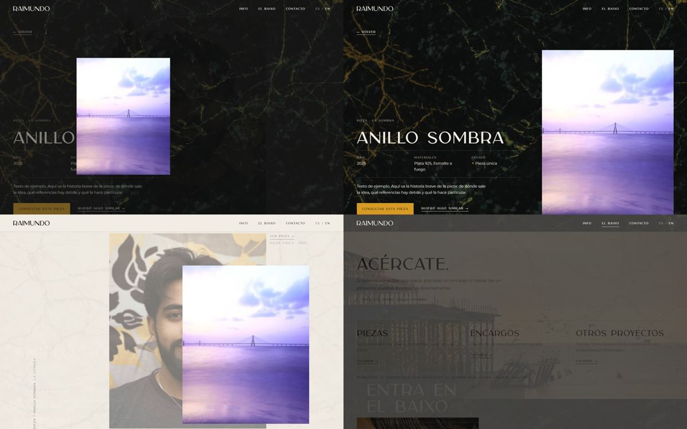

# Raimundo web - draft v0

A working draft to evaluate **structure, navigation and transitions**. Date: 2026-09-17.

This draft is not the final site. The content model (MDX files per piece) is not built, the photos are placeholders and the texts are shortened. Decisions and reasons live in [plan-web-v1.md](plan-web-v1.md). This file explains what the draft does, how it is built and what to look at.

---

## 1. Run it

Needs Node `>= 24` and pnpm.

```bash
pnpm install
pnpm dev        # http://localhost:4321, live reload
pnpm build      # static site in dist/
pnpm preview    # serve dist/ (Astro 7 runs it in the background: `pnpm astro preview stop` to stop)
pnpm check      # type check
```

What to open:

| URL | View |
|---|---|
| `/` | Home: opening + gallery |
| `/piezas/colgante-luna` | Piece (any slug from `src/data/pieces.ts`) |
| `/info` | Info |
| `/el-baixo` | El Baixo |
| `/contacto` | Contacto |
| `/contacto?pieza=anillo-sombra` | Contacto, coming from a piece |
| `/en`, `/en/pieces/colgante-luna`, `/en/info`... | English |
| `/aviso-legal`, `/privacidad`, `/no-existe` | Legal pages and 404 |

To test on a phone on the same network: `pnpm dev --host`.

---

## 2. What to evaluate

1. **Home as gallery.** Does the opening collage + photo pairs work as the only catalogue page? Is the empty space between pieces too much or too little?
2. **Menu.** 3 links on desktop, `MENÚ` overlay on mobile. Is it enough to find Info, El Baixo and Contacto?
3. **Gallery -> piece -> back.** The photo moves into the piece page and returns to its place. Does it help, or does it distract?
4. **Piece page.** Short text at the top, then only photos. Is the "Consultar esta pieza" button clear enough?
5. **Info.** Raimundo + Proceso + 4 C slogan on one page. Too long, or right?
6. **El Baixo.** Dark, photo-heavy. Does the marble with a soft veil work behind it?
7. **Contacto.** Encargos inside Contacto, with 3 reasons that open email with a subject.
8. **Marble backgrounds** with a real screen and real light.
9. **Language switch.** It keeps you on the same view and the same piece.

---

## 3. Structure



### 3.1 Views and routes

| View | ES | EN | Background | Template |
|---|---|---|---|---|
| Home | `/` | `/en` | `marmol_marfil` + marfil veil 72% | `src/views/HomeView.astro` |
| Piece | `/piezas/[slug]` | `/en/pieces/[slug]` | `marmol_negro` + carbón veil 60% | `src/views/PieceView.astro` |
| Info | `/info` | `/en/info` | `marmol_marfil` | `src/views/InfoView.astro` |
| El Baixo | `/el-baixo` | `/en/el-baixo` | `marmol_negro` + carbón veil 42% | `src/views/BaixoView.astro` |
| Contacto | `/contacto` | `/en/contact` | `marmol_marfil` | `src/views/ContactView.astro` |
| Legal | `/aviso-legal`, `/privacidad` | `/en/legal-notice`, `/en/privacy` | `marmol_marfil` | `src/views/SimpleView.astro` |
| 404 | `/404` | - | `marmol_burdeos` + carbón veil | `src/views/SimpleView.astro` |

Each file in `src/pages/` is 3 to 15 lines. It only passes the locale (and the piece) to the template in `src/views/`. Spanish and English share the same templates.

### 3.2 Home

- **Opening.** Collage of 5 photos (3 on mobile), the slogan, "Hecho en El Baixo." and one line of intro. No buttons.
- **Gallery.** One block per piece, in the order of the `pieces` array. 3 layout variants rotate (`v0`, `v1`, `v2` in `PieceSpread.astro`). Each block is one link to the piece and has:
  - Photo 1 (product). This is the photo that moves into the piece page.
  - Photo 2 (worn), with light parallax.
  - Vertical label `PIEZA / NAME. COLLECTION.` (horizontal on mobile).
  - `VER PIEZA →` and `STATUS · YEAR · EDITION`.



### 3.3 Piece

- Carbón header: `← Volver`, collection, name, facts (year, materials, status, edition), story, `CONSULTAR ESTA PIEZA` button and `Quiero algo similar` link.
- The product photo on the right (on top on mobile).
- Photo grid: every third photo full width, the others in pairs. Click opens the lightbox.
- `Siguiente pieza` block with the next piece's photo.



### 3.4 Info, El Baixo, Contacto

- **Info:** photo + "Una forma propia de entender la joyería." / Proceso with 5 steps (a sideways swipe row on mobile) / 4 C as a slogan.
- **El Baixo:** full-width workshop photo with the title on a dark panel / La historia with two overlapping photos / La gente, 4 portraits / Rudi / Hecho en El Baixo with `Fondo_Sello_bajorelieve.png`. On this view the text sits on dark panels, because the soft veil lets the gold veins show.
- **Contacto:** "Acércate." / 3 reasons (Piezas, Encargos, Otros proyectos) that open email with a subject / Encargos block with the 5 steps / channels (email, Instagram, WhatsApp marked as draft).

| Info | El Baixo | Contacto |
|---|---|---|
|  |  |  |

Note: these full-page captures show the marble only in the first screen. In a browser the marble is a fixed layer, so it stays behind the whole page while you scroll.

### 3.5 Header and footer

- **Header** (`src/components/Header.astro`): fixed. Transparent at the top, then a translucent bar with blur after 24 px of scroll. Desktop: wordmark + `INFO · EL BAIXO · CONTACTO · ES / EN`. The current view is underlined.
- **Footer** (`src/components/Footer.astro`): 4 C slogan, seal + "Hecho en El Baixo · Valencia", Instagram, Email, legal links.

---

## 4. Navigation

### 4.1 Desktop

```
            +-----------------------------------------------+
  header -> | RAIMUNDO            INFO  EL BAIXO  CONTACTO  ES/EN |
            +-----------------------------------------------+
                 |         |        |          |        |
               Home      Info    El Baixo   Contacto  same view, other language
                 |
          gallery block --click--> Piece --"Volver"/back--> Home (same scroll position)
                                     |
                                     +-- "Siguiente pieza" --> next Piece
                                     +-- "Consultar esta pieza" --> Contacto?pieza=slug
                                     +-- "Quiero algo similar" --> Contacto?pieza=slug&motivo=commission
  footer -> Instagram, Email, Aviso legal, Privacidad
```

### 4.2 Mobile



- Header: `R` seal (home) and `MENÚ`.
- `MENÚ` opens a native `<dialog>` over the page: marble negro, `INFO / EL BAIXO / CONTACTO` in large type, then `English`, Instagram, Email. `CERRAR`, `Esc` or a link closes it. Focus stays inside the menu while it is open.
- The menu closes by itself if the window grows past 760 px.

### 4.3 Rules behind the links

| Link | Behaviour | Code |
|---|---|---|
| `← Volver` on a piece | If the previous view was the gallery (same language), it calls `history.back()`. The router restores the scroll position. If you opened the piece directly, it goes to `/#slug` and scrolls to that piece | `src/scripts/menu.ts` |
| Browser back | Same result: gallery at the same scroll position, photo returns | Astro `ClientRouter` |
| `ES / EN` | Goes to the same view in the other language. For a piece, the same slug. It **replaces** the history entry, so back does not jump between languages | `data-astro-history="replace"` |
| `Consultar esta pieza` | Opens Contacto with `?pieza=slug`. A script shows "Consulta sobre ..." and adds the piece name to every email subject. The Piezas reason gets an ámbar background | `ContactView.astro` |
| `Quiero algo similar` | Same, with `&motivo=commission`. The Encargos reason gets the highlight | `ContactView.astro` |
| Links on hover | Astro prefetches the page on hover, so the next view is ready before the click | `prefetch` in `astro.config.mjs` |

---

## 5. Transitions

Astro's `ClientRouter` (`astro:transitions`) turns each link into a View Transition: the browser takes a picture of the old page, swaps the content, and animates between the two. Browsers without the View Transitions API load the page normally.



Top left: the photo flies from the gallery to the piece page. Top right: the end state. Bottom left: going back, the photo returns to its place in the gallery. Bottom right: crossfade from Contacto to El Baixo.

| Transition | What happens | Duration | How |
|---|---|---|---|
| Gallery -> Piece | Photo 1 moves and grows into the piece header. The rest crossfades, marfil to carbón | 620 ms move, 360 ms fade | Same `transition:name="piece-{slug}"` on both photos, `view-transition-class: piece-photo` |
| Piece -> Gallery | Reverse movement. The gallery is already at the old scroll position when the new picture is taken | 620 ms | Router restores scroll before `astro:after-swap`, `motion.ts` marks on-screen blocks as visible in that event |
| Piece -> Next piece | The small next-piece photo grows into the new header | 620 ms | `transition:name` on the next-piece photo |
| Any view -> Info / El Baixo / Contacto | Old view fades out, new view fades in. Marble and colors fade with it | 260 ms out, 360 ms in (80 ms delay) | `::view-transition-old/new(root)` in `global.css` |
| Header | Does not move or blink | 0 | `transition:name="site-header"` + `transition:animate="none"` |
| Mobile menu open | Overlay fades in, links move up one after another | 320 ms, links 520 ms with 70 ms steps | CSS keyframes in `Header.astro` |
| Mobile menu -> view | Overlay starts fading, then the normal crossfade | 220 ms + crossfade | `is-closing` class |
| Lightbox | Fade in. Arrows, swipe left/right, swipe down or `Esc` to close | 220 ms | `PieceMedia.tsx` |

Inside a view:

| Effect | Where | How |
|---|---|---|
| Reveal on scroll: fade + move up 1.75 rem | Photo 2 and info of each gallery block, collage tiles, Info steps, El Baixo blocks | `data-reveal` + `IntersectionObserver` in `src/scripts/motion.ts` |
| Parallax: photo 2 moves at 8% of its distance to the screen centre | Gallery blocks | `data-parallax`, CSS `translate` property (separate from the reveal `transform`) |
| Hover | Photo 2 zooms to 103%, arrows move | CSS |

**Reduced motion.** With `prefers-reduced-motion: reduce` the view transitions, reveal and parallax are off. Pages change instantly.

**Two rules that keep the photo movement clean:**

1. Photo 1 in the gallery is never hidden by the reveal effect and never gets parallax. If it did, the return movement would land on an invisible or shifted photo.
2. Photo 1 has the same aspect ratio (4:5) in the gallery, in the piece header and in the next-piece block, so the picture does not stretch while it moves.

---

## 6. Code map

```
src/
  assets/
    backgrounds/        marmol_marfil.png, marmol_negro.png, marmol_burdeos.png, Fondo_Sello_bajorelieve.png
    photos/             real-01..08.jpg (PDF moodboard), random-01..18.jpg (picsum placeholders)
  components/
    brand/Logo.astro    wordmark, generated from branding/logotipo/logotipo.svg
    brand/Seal.astro    R seal, generated from branding/sello/sello.svg
    gallery/Opening.astro
    gallery/PieceSpread.astro
    react/PieceMedia.tsx (+ .module.css)   photo grid + lightbox, the only React island
    Header.astro  Footer.astro
  data/
    pieces.ts           8 placeholder pieces (hardcoded, no MDX)
    photos.ts           photo sets for opening, Info, El Baixo, Contacto
    site.ts             email, Instagram, WhatsApp
  i18n/
    index.ts            routes ES/EN, piecePath(), routePath()
    ui.ts               short interface strings
    copy.ts             page texts (ES from texts/raimundo_texts.md, EN draft translation)
  layouts/BaseLayout.astro   <head>, ClientRouter, marble layer, theme, header, footer
  scripts/motion.ts     reveal, parallax, header on scroll
  scripts/menu.ts       mobile menu, "Volver" logic
  styles/global.css     tokens, fonts, reset, marble layer, reveal, view transition rules
  views/                one template per view, shared by ES and EN
  pages/                routes only
public/
  fonts/carla-sans/carla-sans.woff2   converted from fonts/carla-sans.ttf (84 KB -> 25 KB)
  favicon.svg           R seal
```

### 6.1 How the marble layer works

`BaseLayout.astro` converts the marble PNG to WebP at build time (`getImage`, 1024 px, quality 72) and puts the URL in a CSS variable on `<html>`. `.backdrop` is a `position: fixed` layer behind the page with three layers: the veil color, the marble, and the plain view color as a fallback. `data-theme="light|dark"` on `<html>` switches the tokens (`--bg`, `--fg`, `--muted`, `--veil`). The router copies the `<html>` attributes of the new page, so theme and marble change during the crossfade.

### 6.2 Stack

| Package | Version | Why |
|---|---|---|
| `astro` | `7.3.2` | Framework. `7.3.3` exists but pnpm's release-age rule blocks packages younger than 1 day |
| `@astrojs/react` + `react`, `react-dom` | `6.0.5`, `19.2.7` | Lightbox island (decision from the plan) |
| `sharp` | `0.35.4` | Image conversion at build time |
| `@fontsource-variable/montserrat` | `5.3.0` | Self-hosted Montserrat |
| `typescript` | `6.0.3` | `astro check` does not work with TypeScript 7 yet (ponytojas.dev has the same problem) |
| `@astrojs/check` | `0.9.10` | `pnpm check` |

`pnpm-workspace.yaml` has `allowBuilds: esbuild: false`, as in ponytojas.dev. Without it pnpm stops the install.

No Tailwind, no Sass, no MDX yet.

---

## 7. What is placeholder

| Item | State | Final source |
|---|---|---|
| Piece photos | 8 real photos from the PDF moodboard (page 44) mixed with 18 random picsum photos, some of them not jewelry | Product + worn photo per piece |
| Pieces | 8 invented names, data and one shared sample story | Team |
| Opening, Info, El Baixo photos | Mixed real/random | Workshop, process and people photos |
| People names in El Baixo | "Nombre" | Team |
| English texts | Draft translation | Review |
| Legal pages | One sentence | Legal texts |
| WhatsApp | Link to the phone in the PDF, marked "Borrador" | Team decision |
| Star separator | CSS shape | Brand graphic elements |
| Form | Not built. Reasons open email | Open decision |
| `noindex` | On every page | Remove at launch |

---

## 8. Checked

Run on the production build (`pnpm build` + `pnpm preview`) with Microsoft Edge (Chromium) in headless mode, 1440x900 and 390x844:

- `pnpm check`: 0 errors, 0 warnings, 0 hints.
- `pnpm build`: 29 pages.
- No console errors on any view, desktop or mobile.
- Gallery -> piece: one view transition, URL changes, photo moves.
- `Volver`: returns with `history.back()`, scroll position restored (2853 px before, 2866 px after).
- Browser back: same.
- `Volver` after opening a piece directly: goes to `/#sello-r`, piece 104 px from the top.
- Unknown URL (`/no-existe`): HTTP 404 with the 404 view.
- Next piece, lightbox (open, arrow key, `Esc`), language switch on a piece, `?pieza=` on Contacto with email subject, nav highlight and theme change, mobile menu open and close on navigation.

Not checked: Safari and Firefox, real phones, touch swipe in the lightbox, keyboard-only use of the whole site, reduced motion in a real browser setting.

---

## 9. Known limits and next steps

- **Firefox and older Safari.** Without View Transitions support, links load the next page with no animation. Navigation still works.
- **Big screens.** The marble PNGs are 1024x1536. On screens wider than about 1600 px they look soft (see plan 5.4).
- **Two named photos per piece page.** The hero and the next-piece photo both have names. When you go back to the gallery, the next-piece photo also moves to its gallery block, but that happens off screen.
- **Gallery length.** With 8 pieces the Home is 9,024 px tall at 1440x900 and 7,032 px at 390x844. With 30 pieces a filter or a shorter spacing may be needed.
- **Mobile overlap.** On a 375x667 screen the opening tiles overlap the slogan. At 390x844 they do not.

Next steps after this review:

1. Adjust structure and transitions from the feedback.
2. Build the MDX content model (plan section 6).
3. Replace placeholders with real photos and texts.
4. Decide the form, analytics and hosting.
